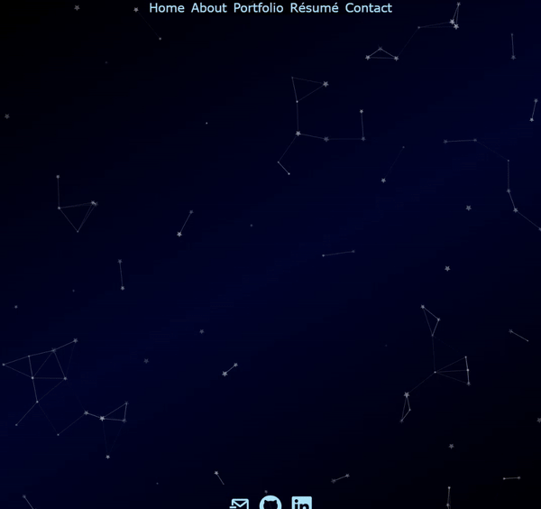

# Professional Portfolio Page

This is my professional portfolio website built in React. It displays my portfolio of coding and design work, while also showcasing my skills for CSS/HTML styling, and graphic design sensibilities. There are also links to my CV and various contact methods.

### Dynamic Scaling

This page scales content and the content proportion of the screen to ideally utilize the space of various screen sizes. Additionally, the navigation bar at the top will reorganize itself into even rows when the viewport width is narrow enough that the row must wrap.

### TypeScript Particles Background

Utilizing Matteo Bruni's [tsParticles library](https://github.com/matteobruni/tsparticles), a dynamic constellation background is generated for a minimally disruptive aesthetic.

---

## Getting Started

These instructions will get you a copy of the project up and running on your local machine for development and testing purposes. See deployment for notes on how to deploy the project on a live system.

### Prerequisites

* IDE to view/edit source code (e.g. Visual Studio Code).
* [Node.js](https://nodejs.org/en/).

### Installing

1. Clone repository.
1. Navigate to `portfolio-iv` directory in terminal.
1. `npm install` dependencies.
1. Run with `npm start` to view on local host.

### Deployment

1. Upload to webhosting service, such as [GitHub](https://github.com/).
1. Build deployable with `npm run deploy`.

---

## Built With

* [React](https://reactjs.org/).
* [JavaScript](https://developer.mozilla.org/en-US/docs/Web/JavaScript).
* [HTML](https://developer.mozilla.org/en-US/docs/Web/HTML).
* [CSS](https://developer.mozilla.org/en-US/docs/Web/CSS).
* [GitHub](https://github.com/).

## Deployed Page

* [See Live Site](https://starryblue7.github.io/portfolio-iv/).

## Author

Vince Lee
- [Portfolio](https://starryblue7.github.io/portfolio-iv/)
- [Github](https://github.com/StarryBlue7)
- [LinkedIn](https://www.linkedin.com/in/vince-lee/)

## License

License: [MIT License](https://vince-lee.mit-license.org/)

## Acknowledgments

* Webhosting by [GitHub Pages](https://github.com/).
* Page component animation by [React Reveal](https://www.react-reveal.com/).
* Background animation by [TypeScript Particles](https://github.com/matteobruni/tsparticles).
* Custom font [Hey August by Khurasan](https://www.dafont.com/hey-august.font).
* Additional fonts from [Google Fonts](https://fonts.google.com/).
* Icons provided by [React Icons](https://react-icons.github.io/react-icons).